# Исследование VLM guidance для генерации и редактирования изображений

<p align="center">
  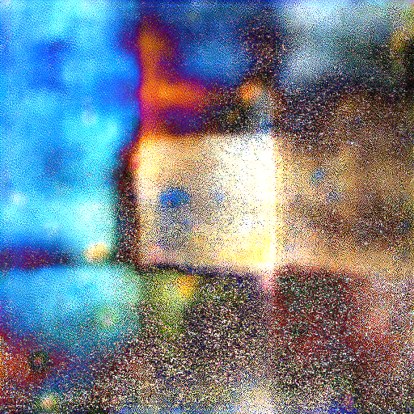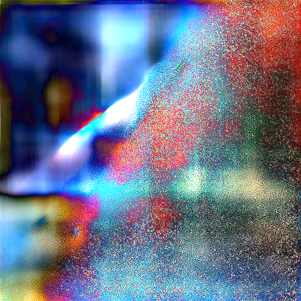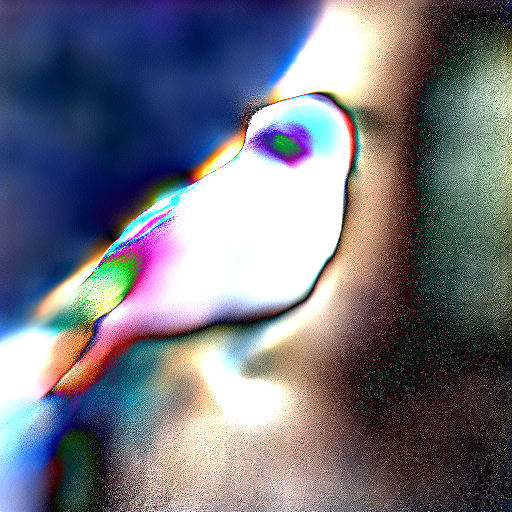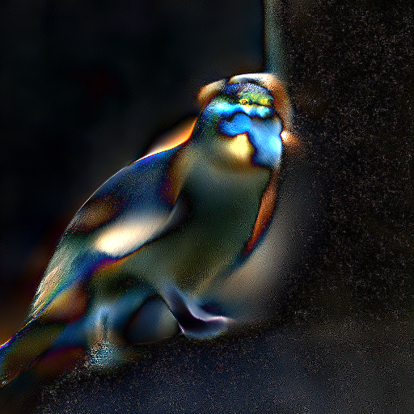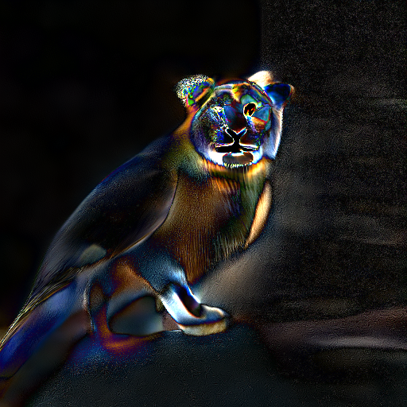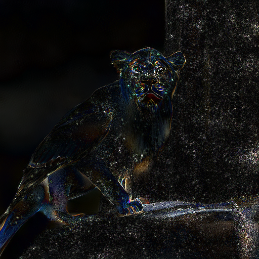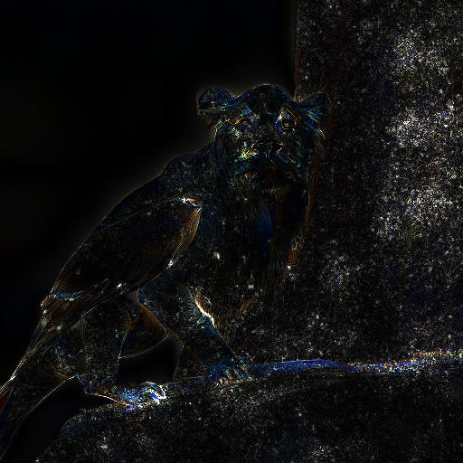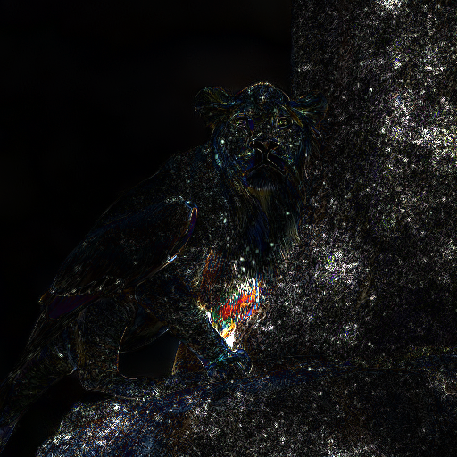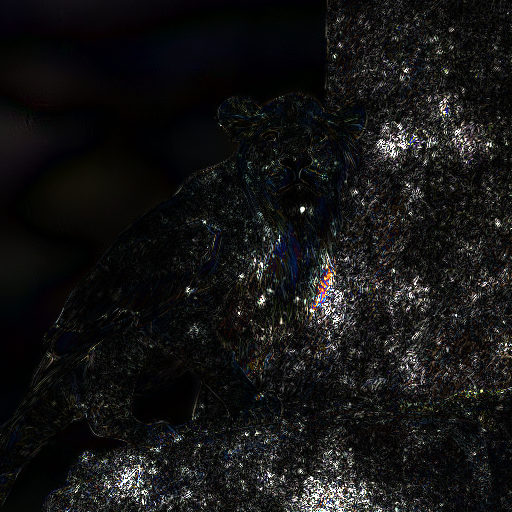
  <br>
  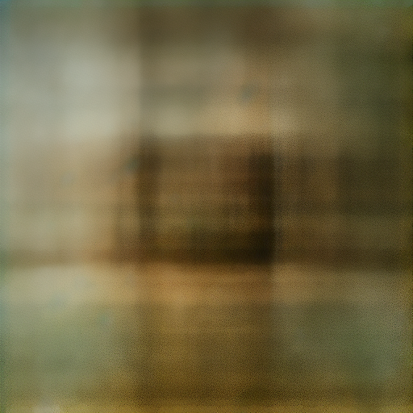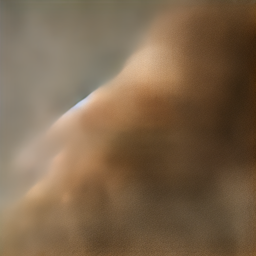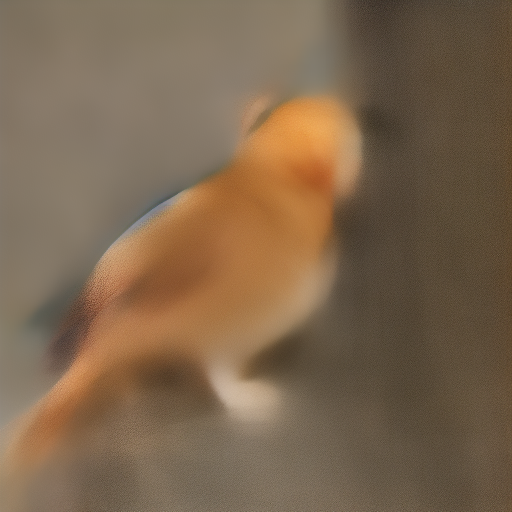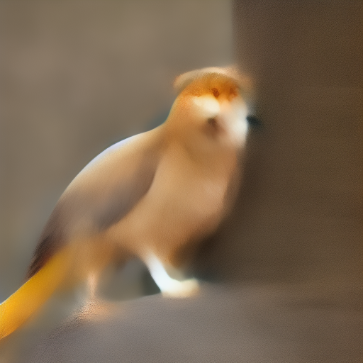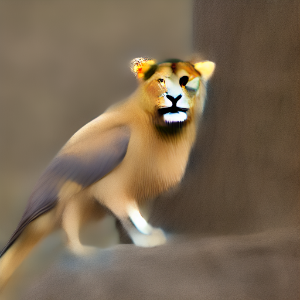
</p>

Этот репозиторий содержит код и артефакты исследования, посвященного использованию `vision-language models` для управления диффузионной генерацией и редактированием изображений. Основная идея работы состоит в том, чтобы во время денойзинга использовать сигнал от VLM как внешнюю функцию согласованности между текущим изображением и текстовым запросом, и по ее градиенту корректировать латентные переменные диффузионной модели.

Практически в репозитории реализованы два сценария:

1. `VLM-guided generation`: сравнение трех пайплайнов text-to-image генерации:
   - `vanilla_sd` - обычный Stable Diffusion 1.5;
   - `vqa_score` - Stable Diffusion 1.5 с VLM-guidance;
   - `flux1` - базовый `FLUX.1-dev` как сильный reference baseline.
2. `VLM-guided editing`: редактирование реальных изображений через `null-text inversion` с дополнительным VLM-guidance во время оптимизации.

Экспериментально работа отвечает на два вопроса:

1. Улучшает ли VLM-guidance семантическое соответствие изображения тексту по сравнению с базовыми диффузионными моделями.
2. Можно ли использовать тот же принцип не только для генерации, но и для редактирования изображений, особенно на сложных или контекстно нетипичных запросах.

Полный разбор постановки задачи, метода и результатов, он находится в [report.pdf](./report.pdf).

## Что есть в репозитории

- `vlm_guidance_project/` - код пайплайнов генерации, включая single prompt и batch режимы.
- `vlm_guidance_editing/` - код пайплайнов редактирования через `null-text inversion` и VLM-guided editing.
- `datasets/` - текстовые наборы промптов и примеры входных данных для редактирования.
- `metrics/` - скрипты для подсчета `CLIP score`, `alignment`, `quality` и визуализации результатов.
- `report.pdf` - полный текст исследовательской работы.

## Что запускать для ознакомления

Если нужно быстро понять проект на практике, достаточно следующей последовательности (команды приведены ниже):

1. Создать окружение и установить зависимости.
2. Запустить генерацию на одном промпте или на файле с промптами и сравнить `vqa_score`, `vanilla_sd`, `flux1`.
3. Посчитать метрики по сохраненным результатам.
4. При необходимости отдельно запустить пайплайн редактирования на примерах из `datasets/coco/...`.

Автор исполнял код на `Python 3.10.20` и `CUDA 12.0/12.6/12.8` на `A100 80GB`. Для запуска `vlm guidance` пайплайна генерации требуется около `39 GB VRAM`; для остальных сценариев этого объема также достаточно.

## Установка репозитория и создание окружения

```shell
git clone git@github.com:AlexKrachun/vlm_guidance_research_dev.git
cd vlm_guidance_research_dev/
conda env create -f environment.yaml
conda activate t2v
pip install flash-attn --no-build-isolation
pip install hydra-core

```

## Запуск трех приведенных пайплайнов генерации
Для исполнения flux пайплайна надо авторизоваться в hugging face:

```shell
hf auth login
```


Запустить vanilla sd1.5, vqa guided sd1.5, flux1-dev на своем промпте
```shell
python -m vlm_guidance_project.vlm_guidance.run \
  run.prompt="a cat on a chair" \
  run.vqa_score=True \
  run.vanilla_sd=True \
  run.flux1=True
```


Запустить vanilla sd1.5, vqa guided sd1.5, flux1-dev на текстовом файле datasets/subset.txt - где каждая строка - это один промпт (можете вписать свои промпты)
```shell
python -m vlm_guidance_project.vlm_guidance.batch_run \
  batch.prompts_file=../datasets/subset.txt \
  run.vqa_score=True \
  run.vanilla_sd=True \
  run.flux1=True \
  batch.output_root_dir=subset_generations    
```


## Подсчет и визуализация метрик

### CLIP score

Посчитат и сохранить в csv файл clip score по папке с изображениями полученными разными пайплайнами (папка получена с помощью прогона `python -m vlm_guidance.batch_run`)
```shell
python3 metrics/clip_score_clalc.py \
  -generations vlm_guidance_project/subset_generations \
  --output metrics/clip_score_subset_result.csv
```

Построить графики clip score по csv со значениями метрики 
```shell
python3 metrics/clip_visualize.py \
--input metrics/clip_score_simple_result.csv \
--output-dir metrics/clip_plots_simple_plots
```


### Alignment и Quality scores
Для подсчета метрик alignment и quality
```shell
export OPENAI_API_KEY="YOUR OPENAI API KEY"
```

```shell
python3 metrics/alignment_score_clalc.py \
  -generations vlm_guidance_project/subset_generations \
  --output metrics/alignment_score_subset_result.csv \
  --api-key "$OPENAI_API_KEY" \
  --concurrency 10
```

Построить графики alignment и quality score по csv со значениями метрик
```shell
python3 metrics/alignment_visualize.py \
  --input metrics/alignment_score_subset_result.csv \
  --output-dir metrics/alignment_simple_plots
```


### Визуализация статистик хода генерации

Сгенерировать граяфик статистики градиентов vlm гайденса
```shell
python metrics/statistics.py --input-root vlm_guidance_project/subset_generations
```


## Запуск пайплайнов редактирования

запустить null-text editing на датасете datasets/coco/first3
```shell
python -m vlm_guidance_editing.vlm_guidance.run \
  run.dataset_root=datasets/coco/first3 \
  run.pipeline_null_text_inversion=True \
  run.pipeline_vlm_guided_editing=True \
  run.output_root_dir=vlm_guidance_editing/first3_resluts \
  algorithm.save_debug_tensors=False \
  algorithm.gd_only_first_k_steps=15 \
  guided.gd_steps=3 \
  guided.zt_optimizing=true \
  guided.zt_lr=1 \
  guided.null_text_emb_optimizing=true \
  guided.null_text_emb_lr=1

```
